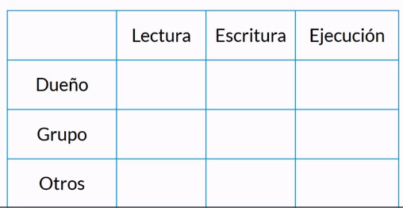
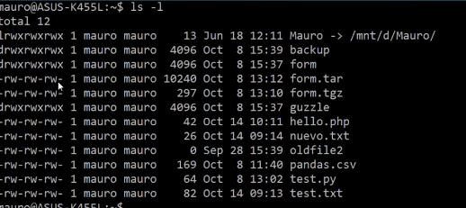
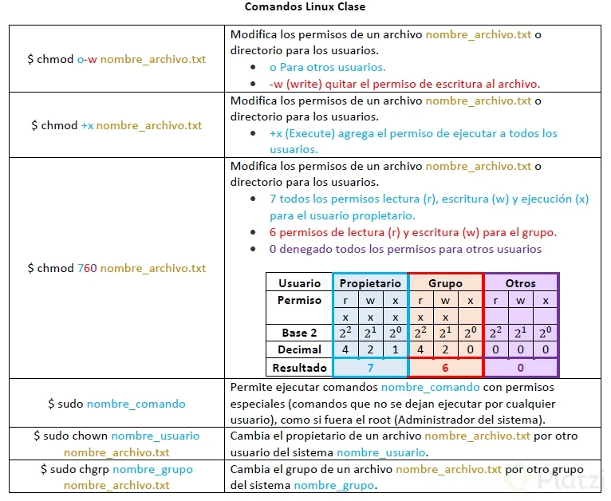

# Introduccion a la terminal y linea de comandos

El contenido de este documento está basado en el curso del mismo nombre dictado por Mauro Chojrin en [Platzi](https://platzi.com/r/jrmelendezm_/).

## Indice

- [Aprender a manipular archivos a traves de la terminal](#aprender-a-manipular-archivos-a-traves-de-la-terminal)

- [Comprender los mecanismos de comunicacion y administracion entre procesos](#comprender-los-mecanismos-de-comunicacion-y-administracion-entre-procesos)
	
	- [Permisos sobre archivos: El sistema de permisos octal](#permisos-sobre-archivos-el-sistema-de-permisos-octal)

- [Conocer las herramientas avanzadas](#conocer-las-herramientas-avanzadas)

- [Automatizar tareas: El verdadero poder de la terminal](#automatizar-tareas-el-verdadero-poder-de-la-terminal)

## Aprender a manipular archivos a traves de la terminal

## Comprender los mecanismos de comunicacion y administracion entre procesos

### Permisos sobre archivos: El sistema de permisos octal

Desde sus comienzos, UNIX fue diseñado como un sistema multiusuario, esto implica que ciertas cuestiones básicas de seguridad están intrinsecas dentro del sistema. Todos los archivos de UNIX tienen:
 - Dueño: la persona que creo el archivo
 - Grupo: Grupo de usuarios asociados a un archivo
 - Otros: Usuario con permisos pero que no es el dueño ni pertenece al grupo de usuarios asociados.

 Las operaciones que se pueden hacer sobre un archivo son:
 - Lectura
 - Escritura
 - Ejecución

 Esto configura la siguiente matriz que nos dice quien puede hacer cada una de las operaciones. Tal vez el dueño puede escribir sobre el archivo pero al grupo se le permite leer pero no escribir.

 

 Para ver los permisos que tiene un archivo asociado podemos ejecutar en la terminal

 ~~~
ls -l
 ~~~

 

 La primera  columna nos muestra los permisos en series de 3 caracteres. El primer caracter indica, por ejemplo, que se refiere a un directorio (d) o cuando es un puntero a otro archivo (l). Luego vemos los permisos que tiene el dueño, el grupo y otros.

 Para alterar los permisos de un usuario tenemos los siguientes comandos: 

 - chmod
 - chown
 - chgrp

 

## Conocer herramientas avanzadas

## Automatizar tareas: El verdadero poder de la terminal