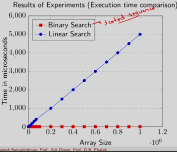
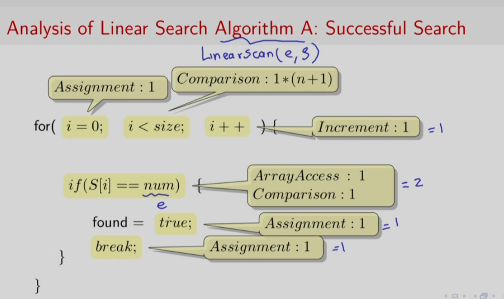
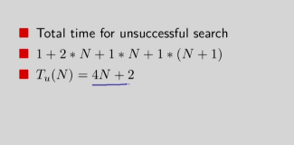
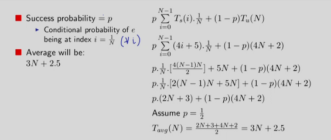

## Indice

- [Topic 1: Complexity](#topic-1-complexity)

	-[Session 1: Running time of Program: Empirical and analytical method](#session-1-running-time-of-program-empirical-and-analytical-method)

		-[Empirical Analysis of Running Time](#empirical-analysis-of-running-time)

		-[Model for Algorithm Analysis](#model-for-algorithm-analysis)

	-[Session 2: Running time of Program: Average and Worst Case Complexity. Asymtotic analysis](#session-2-running-time-of-program-)
		
		-[Search Algorithm A](#search-algorithm-a)
		
		-[Search Algorithm B](#search-algorithm-b)
		
		-[Recursion vs Iterative](#recursion-vs-iterative)

	-[Session 3: Order of running time of an algorithm. Big-oh, Small-oh, Omega and theta](#session-3-order-of-running-time-of-an-algorithm-big-oh-small-oh-omega-and-theta)

- [Topic 2: Sorting](#topic-2-sorting)

- [Topic 3: Searching graph based](#topic-3-searching-graph-based)

- [Topic 4: Spanning Trees and Numeric Algorithms](#topic-4-spanning-trees-and-numeric-algorithms)

- [Topic 5: String algorithms](#topic-5-string-algorithms)

- [Topic 6: Geometric Algorithms](#topic-6-geometric-algorithms)

## Topic 1. Complexity

### Session 1. Running time of Program. Empirical and Analytical method

Consideremos un ejemplo canonico: Buscar el elemento _e_ en una secuencia _S_. Veremos que el running time depende de que tan grande es S pero tambien de la posición de _e_.

Nuestra función depende de:
	- Input Size
	- Position of _e_

¿Cómo la caracterizamos?
Podemos hacerlo empiricamente a través de Correr el programa (con unos experimentos diseñados) varias veces con un gran numero de diferentes inputs (Tanto secuencias S como elementos e) y tomar el tiempo de cada ejecución para poder computar el promedio del tiempo de ejecución.

#### Empirical Analysis of Running Time

Para poder ejecutrar un analisis empírico del tiempo de ejecución tenemos que eliminar o normalizar factores externos:
- No podemos tener procesos corriendo en background
- Estructuras de datos comparables y tipos de data comparables. No es comparable un entero con un flotante

Hay muchos factores que pueden afectar la ejecución de nuestro programa, por lo tanto necesitamos normalizar los procesos relacionados también al OS/Kernel.
- Promediar a través de multiples ejecuciones para cada programa
- Usar maquinas virtuales para garantizar los recursos

Como resultado de experimentos para comparar el tiempo de ejecución en una secuencia ordenada, vemos el crecimiento de una **Búsqueda lineal** y una **Búsqueda binaria** en el siguiente gráfico

Vemos que el algoritmo de busqueda binaria crece lentamente a medida que aumenta el tamaño del arreglo en comparación con el algoritmo de búsqueda lineal.

**Algunas cuestiones sobre el analisis empirico**

Con el análisis empirico ocurren diversas cuestiones. La primera es que el razonamiento sobre la salida precede la experimentacion. Si tu razonas luego de la experimentacion entonces no hay nada que esperar de un algoritmo en particular, por lo tanto, el metodo consume mucho tiempo en razonar y razonar post hoc. Además porque consume tiempo en el numero de algoritmo, numero de corridas y en toda experimentación que uno pueda hacer habrán factores ocultos que pasan desapercibidos a pesar de hacer el mayor esfuerzo por normalizar, por ejemplo, el hardware, el compilador,etc.

- Podemos ignorar el comportamiento esencial del algoritmo al centrarnos en detalles innecesarios.

Aún asi, realmente esto no sustituye el analisis en papel porque aquí es donde se obtiene una comprensión fundamental de un sistema.

#### Model for Algorithm Analysis

Para construir un modelo para el analisis de nuestro algoritmo seguimos:

- Instrucciones secuenciales y memoria infinita. Vamos a asumir que se procesan secuencialmente las instrucciones y que tiene memoria infinita para cargar con cualquier data auxiliar.
- Cualquier instruccion sencilla toma unidades de tiempo: Adiciones, sustracciones, multiplicaciones, divisiones, operaciones con bits, comparaciones, asignaciones, etc. Se sabe de la practica que multiplicacion y division pueden ser mas costosos que adicion o sustraccion.
- Se asumira para ambos tipos de datos: integers y floating point. Por lo tanto, este proceso va a ignorar tiempos discretos, jerarquías de memorias, paging, context switching, etc.

Veamos el siguiente esquema

Esta es una busqueda lineal. Se necesita de un bucle for que recorra la secuencia S, con una asignación (se ejecuta solo una vez), comparación e incremento. La sentencia condicional para verificar si conseguimos el numero requiere acceso al arreglo en las posiciones y hara simultaneamente un acceso y una comparacion. Si lo encuentra, hace un break, si no, continua.

Por lo tanto, vemos que el tiempo requerido por nuestro algoritmo va a depender basicamente en donde se consigue el elemento e. Si el elemento se consigue al final del arreglo entonces debimos ejecutar nuestro algoritmo n o n-1 veces. Los ultimos dos pasos, de asignación y break se habran ejecutado solamente una vez. Por lo tanto,

Tenemos que el analisis de nuestro algoritmo en una **búsqueda exitosa** será: 

~~~
      i=0        i<size         i++        S[i]==num      found=true      break
       1    +    1*(n)   +   1*(n-1)   +   (2*n)       +       1       +    1    
    =  4n + 2
 Ts(n) = 4n + 2

~~~

En el caso de no tener una busqueda exitosa, es decir, no se consigue el elemento _e_ en nuestro arreglo, tendremos que: 

Entonces aquí la comparacion es entre 4 veces n+5 y 4 veces N+2. Entonces como se computa esto? Como obtendremos un promedio y que significa el promedio en este contexto?. Vamos a medir un promedio a traves de todos los posibles valores de un numero (el elemento e) mientras mantenemos la longitud del arrelo fija. Aquí vemos que en realidad no tiene sentido buscar por un gráfico tiempo vs numero; lo que tiene signficado es la busqueda tiempo vs lenght[S], cambiando la longitud y el promedio de todos los valores. Aquí esperamos ver resultados empiricos pero anticipandonos analiticamente

### Session 2. Running time of Program. Average and Worst Case Complexity, asymptotic analysis

#### Search Algorithm A

**Search Algorithm A: LinearScan(e,S)**

Continuamos trabajando con nuestras algoritmo de busqueda lineal. En particular, estamos discutiendo sobre el caso promedio y peor caso (average and worst case complexity). Nos vamos a centrar en nuestro algoritmo A que es un scan algorithm que intenta encontrar el elemento e en una secuencia S. Veremos dos distintas nociones del analisis: 

- **Dos caminos:**
	- Average (or expected value): A través de todas las instancias del input. Es un escenario muy frecuente, buscando en todas las instancias
	- Maximun (or Worst case): Este es de nuevo buscando en todas las instancias pero solo nos centramos en el peor desempeño posible.

Para esto tendremos que computar una distribucion de probabilidad en los inputs, por ejemplo, la probabilidad de encontrar e en S. Asumimos que la probabildiad de existo es _p_. Los componentes de nuestra distribucion de probbilidad serian:
	- Probabilidad de una busqueda exitosa: probabilidad de que e se consiguio en S
	- Probabildiad de posisicon del elemento e: probabilidad de que e se consiguio en S en la posicion i

Aqui vemos cual seria la probabilidad (tomando las expresiones que ya vimos para el caso de Success y Unsuccess). 
- **El avergase seria 3N + 2.5**
- **El peor caso** es decir, cuando el elemento e no se consigue sería T_worst(N) = 4N + 2

#### Search Algorithm B

**Alternativa: Binary Search**

Veamos el siguiente script para ilustrar como funciona la busqueda binaria:

~~~
bsearch(vector<int> &S, int num , int begin, int end ){
	int mid;
	mid = (begin + end)/2;
	if(begin > end)
		return false;
	else{
		if(S[mid] == num)
			found = true;
		else if(num < S[mid])
			bsearch(S,num,begin,mid - 1);
		else
			bsearch(S,num,mid+1,end);

	}
}

~~~

Vemos que este algoritmo agarra un inicio, final y computa un medio. Si la lista S es una secuencia ordenada, se para en el medio y pregunta si el numero objetivo está en el extremo superior (> S[mid]) o en el extremo inferior (< S[mid]). Esto continúa hasta hallar el numero.

Aqui tendriamos importantes aspectos del tiempo que toma una llamada de la funcion:
	- Asignacion y operaciones matematicas 3
	- Comparasion 5 (3 en la llamada final)
	- La llamada de la funcion es mas costosa con una invocacion arbitraria C. Este costo es por la llamada recursiva. Este costo se debe considerar cuando hay una alta recursividad. Toda esa informacion debe ir guardandose en memoria para que el algoritmo la pueda continuar.

#### Recursion vs Iterative

- Llamadas recursivas pueden involucrar mas overheads (Gastos)
- Necesidad de almacenar en un estado paralelo del programa
- Usa stack (memoria) para mantener estados

Si tomamos como ejemplo una implementacion del factorial, este puede ser llamado usando la recursion ( fact(n) = n * fact(n-1)) o una  llamada iterativa (En un bucle for(i = 1, i < n, i++){fact = fact * i})

### Session 3. Order of running time of an algorithm. Big-oh, small-oh, Omega and Theta

## Topic 2. Sorting
Dos textos
## Topic 3. Searching graph based

tres 

## Topic 4. Spanning Trees and Numeric Algorithms

cuatro

## Topic 5. String Algorithms

cinco

## Topic 6. Geometric Algorithms 

seis